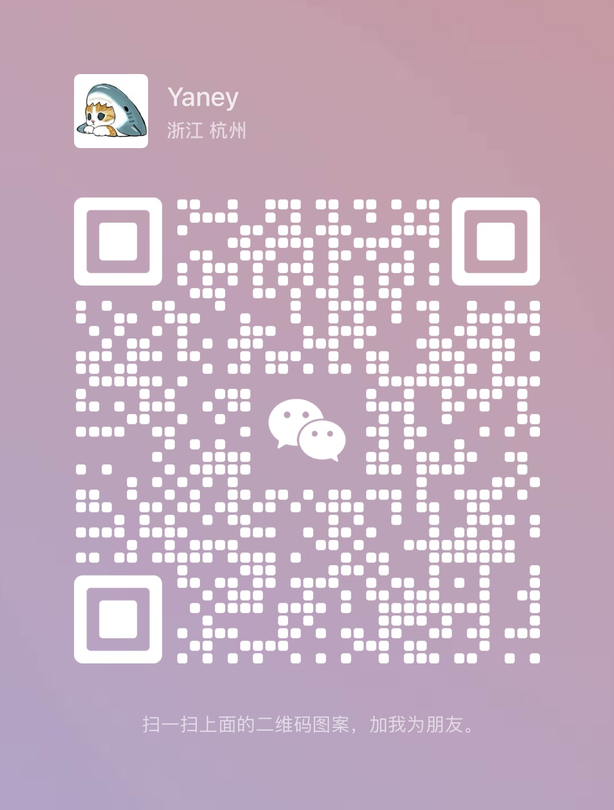

# LLM Security 学习资料与知识输出 🛡️

欢迎来到 LLM Security 学习社区的 GitHub 仓库！这个仓库旨在收集与分享关于语言模型安全（LLM）的相关学习资料、知识输出以及解读。

## 我们的目标 🎯

- 提供高质量的学习资料，帮助大家更好地了解语言模型安全的概念、技术和最佳实践。
- 分享我们的知识与经验，促进社区成员之间的学习与讨论。
- 推动语言模型安全领域的发展与创新。

## 如何贡献 🤝

我们欢迎任何形式的贡献！您可以通过以下方式参与：

- 提交新的学习资料或知识输出。
- 指出资料中的错误或提出改进建议。
- 参与讨论，分享您的见解和经验。
- 向仓库添加您自己的解读或研究成果。

## 如何开始 🚀

1. 点击右上角的 "Star" 按钮关注我们的仓库，以获取最新的更新和通知。
3. 浏览仓库中的资料，找到您感兴趣的主题，并开始学习与讨论。

## 联系我们 📧

如果您有任何问题、建议或合作意向，欢迎通过 GitHub Issues 、[电子邮件](mailto:yangli.yaney@foxmail.com)或者微信与我们联系。我们可以新疆一个 LLM Security 讨论群聊，期待与您共同打造一个充满活力的语言模型安全学习社区！

  

